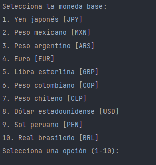
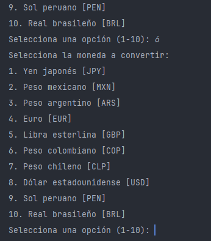
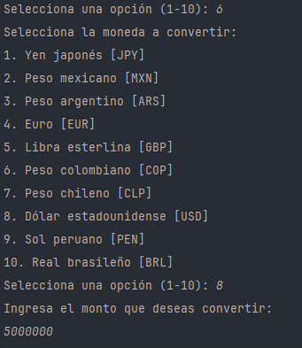
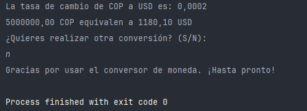

# Conversor de Moneda

## Descripción
Este proyecto es un conversor de moneda que permite convertir entre varias divisas utilizando la API de ExchangeRate.

## Características
- Conversión de divisas entre diferentes monedas.
- Soporte para monedas principales como USD, EUR, JPY, y monedas latinoamericanas como COP, MXN, BRL.
- Obtención de tasas de cambio en tiempo real mediante la API de ExchangeRate.

## Instalación
Para ejecutar este proyecto en tu máquina local, sigue estos pasos:

1. Clona el repositorio:
    ```bash
    git clone https://github.com/JohanDevia/Conversor-de-Moneda.git
    ```
2. Asegúrate de tener **Java** instalado en tu sistema (versión 11 o superior).

3. Abre el proyecto en **IntelliJ IDEA** o en cualquier IDE de tu elección.

4. Añade las dependencias necesarias:
    - `gson` para parsear las respuestas JSON de la API.

5. Ejecuta el archivo `Main.java` para iniciar el conversor.

## Uso
1. Ejecuta el programa.
2. Selecciona la moneda base y la moneda de destino.
3. Introduce la cantidad que deseas convertir.
4. El sistema te mostrará la tasa de cambio actual y el valor convertido.

## Ejemplo de uso
Al ejecutar el programa te mostrara un menu inicial.


Te pedira que elijas una moneda base de la lista para iniciar.

Luego te pedira que elijas una moneda a convertir.



Seguido te pedira que ingreses un monto.



Despues de haber ingresado estos datos la aplicacion te entregara 
la tasa de cambio y la conversion de la moneda base a la moneda objetivo
y te preguntara si quieres realizar otra conversion.


